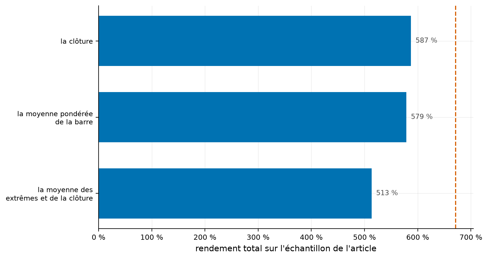
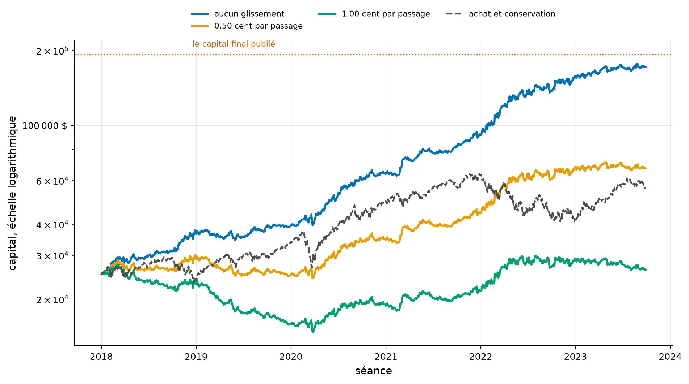
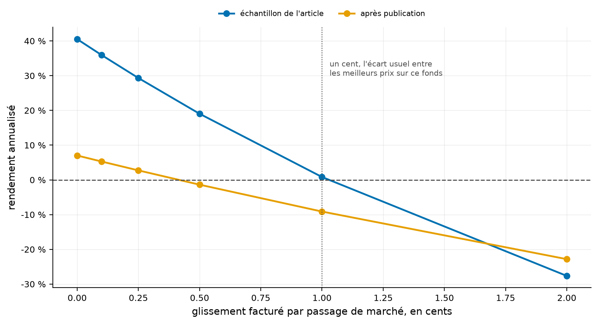
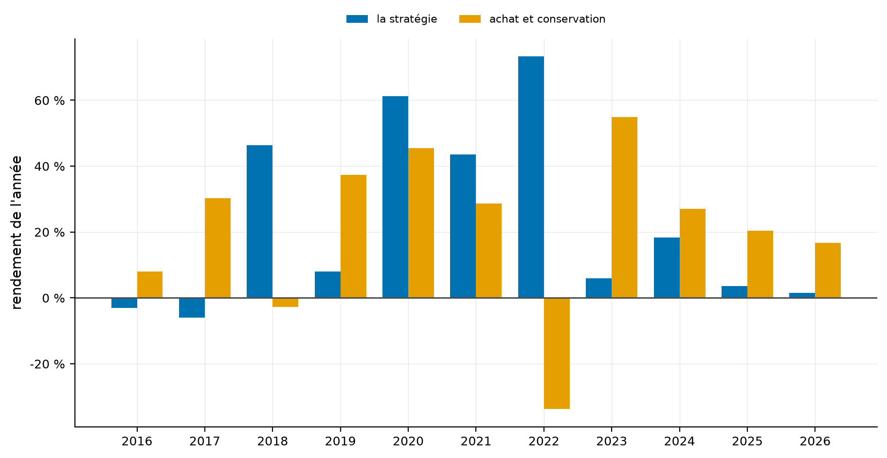
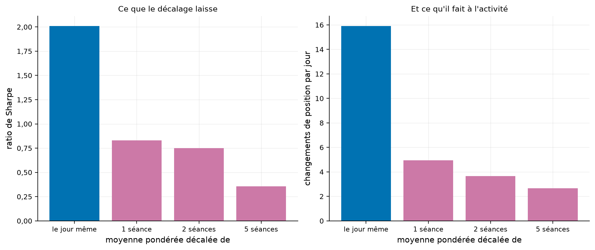

# La stratégie qui transforme 25 000 dollars en 2 millions en perd si l'on paie un demi-cent

Un article très lu annonce qu'un signal fondé sur le prix moyen pondéré par les volumes aurait
transformé 25 000 dollars en 192 656 sur six ans, et en 2 millions avec un fonds à levier. Il suppose
que le glissement, l'écart entre le prix visé et le prix réellement obtenu, est nul. La stratégie
change de position **seize fois par jour** : ce dépôt mesure ce que cette hypothèse vaut.

[](https://github.com/Guilou001/21-vwap-intrajournalier/actions/workflows/ci.yml)


**Le résultat.** Le repère passif de l'article se reproduit **à trois centièmes de point près**, ce
qui atteste les données. Sa stratégie active se reproduit à 587 % contre 671 % publiés, avec un
ratio de Sharpe de 2,01 contre 2,10. Mais elle s'annule à **1,02 cent** de glissement par passage.
Après la fermeture de son échantillon, elle s'annule à **0,41 cent**, et son rendement annuel tombe
de 40,5 % à **7,0 %** avant tout glissement.

*Summary in English. Zarattini and Aziz (SSRN 4631351) report that a VWAP trend-following day trading
system would have turned $25,000 into $192,656 on QQQ between January 2018 and September 2023, a 671 %
return with a 2.1 Sharpe ratio and a 9.4 % maximum drawdown, and into $2,085,417 using the 3x
leveraged TQQQ. Their backtest assumes zero slippage; it does charge the $0.0005 per share commission
they declare, and so does this replication. Replaying the published rules on consolidated one-minute
bars: the passive benchmark reproduces to within 0.03 percentage points, confirming the data and
window; the active strategy reaches 587 % with a 2.01 Sharpe and a 9.3 % drawdown. It flips position
15.9 times per session. Charging 1.02 cents of slippage per fill wipes the entire in-sample return.
After the sample closes the break-even is 0.41 cents and the zero-slippage annual return falls from
40.5 % to 7.0 %. On TQQQ the replication ends at $1,643,784 where the paper reports $2,085,417, and
half a cent leaves $21,721 of the $25,000 start, a 13 % loss. Finally, the two years immediately
preceding the paper's sample, 2016 and 2017, are both negative.*

## 1. La question posée

**Le signal, en mots simples.** À chaque minute, on divise tout l'argent échangé depuis l'ouverture
par toutes les actions échangées. Le résultat est le prix moyen payé depuis le matin. Si le prix du
moment est au-dessus, les acheteurs paient plus cher que la moyenne du jour, ce que l'article lit
comme un déséquilibre en faveur de la hausse.

**La règle.** On est acheteur quand le prix est au-dessus de cette moyenne, vendeur à découvert
sinon, tout le capital à chaque fois, et l'on solde à la clôture. Rien de plus.

**Ce que l'article annonce**, dans son tableau 1 :

| | Rendement total | Par an | Volatilité | Sharpe | Pire creux |
|---|---:|---:|---:|---:|---:|
| Le signal sur QQQ | 671 % | 43 % | 18 % | 2,1 | 9,4 % |
| Acheter et conserver QQQ | 126 % | 15 % | 25 % | 0,7 | 35,6 % |

**L'hypothèse qui porte tout.** L'article l'écrit lui-même :

> Since we initiated our system with a small account of only $25,000, we assumed **no slippage** in
> our order fills.

Une stratégie qui change de position seize fois par jour franchit seize fois l'écart entre les
meilleurs prix acheteur et vendeur. La question du dépôt est de savoir ce que ce franchissement
coûte.

**Ce que l'article facture, en revanche.** Il déclare une commission de 0,0005 $ par action, le tarif
qu'il attribue à Interactive Brokers. Tous les résultats de ce dépôt la portent, sans exception.
Quand une ligne dit « aucun glissement », elle dit bien le glissement seul.

## 2. D'où vient le projet, et ce qu'il apporte

Trois apports.

- **Le repère passif d'abord**, qui n'a aucun paramètre : s'il tombe juste, un écart sur la stratégie
  active vient de ses règles et non des prix.
- **La facture**, en cents par passage, dans l'échantillon de l'article puis après sa fermeture.
- **Trois contrôles** que l'article ne fait pas. Le prix retenu pour la moyenne. Un placebo qui
  emploie la moyenne d'un autre jour. Et le rendement année par année, de part et d'autre de la
  fenêtre choisie.

Une correction au passage : SSRN renvoie 403 aux scripts, et ce dépôt a d'abord tenu le PDF pour
inaccessible. Il est en libre accès sur le site du premier auteur, `concretumgroup.com`, mesuré le
30 août 2026 à 1 012 421 octets et 26 pages. La règle vaut d'être retenue : chercher le PDF chez
l'auteur avant de conclure qu'il est fermé.

## 3. Le flux consolidé, et non celui d'IEX

Barres d'une minute du **flux consolidé**, le ruban qui rassemble les transactions de toutes les
places américaines, en prix bruts. De janvier 2016 au 28 août 2026, sur QQQ et sur TQQQ.

Le flux gratuit d'IEX ne portait pas ce prix moyen. Il ne recueille que 1,37 % du volume consolidé de
QQQ, chiffre mesuré non pas ici mais dans le dépôt voisin
[24-vwap-iex-vs-consolide](https://github.com/Guilou001/24-vwap-iex-vs-consolide), du 3 août 2020 au
28 août 2026. Le même dépôt mesure qu'IEX publie tout de même une barre dans 91,9 % des minutes de
séance : le défaut n'est donc pas qu'il se taise, c'est qu'il pèse un soixante-treizième du marché.

**Ce que le filtre de séances retient.** La grille d'une séance régulière tient 391 minutes, de
celle de 9 h 30 à celle de 16 h 00, qui recueille l'impression de clôture. Le filtre en exige au
moins 390, donc il tolère une minute manquante et une seule. Sur QQQ, les séances gardées portent
toutes les 391 ; sur TQQQ, moins échangé, 67 d'entre elles n'en portent que 390.

Les 29 séances qu'il écarte sont publiées une à une dans `results/tables/seances_retirees.csv`, avec
leur nombre de barres, leur dernière barre et leur plus longue interruption. Vingt et une sont des
veilles de congé, dont la séance régulière ferme à 13 h. Leur dernière barre y paraît pourtant plus
tardive, le fournisseur publiant aussi les impressions clairsemées d'après la cloche.

Deux, les 2 et 3 mai 2018, ne portent que deux barres chacune. Deux autres, en février 2016, sont
trouées de 10 et 47 minutes. Les quatre dernières sont des séances pleines interrompues quinze
minutes, en mars 2020, et la section 5.8 mesure ce que leur retrait coûte.

## 4. La méthode, pas à pas

1. **Reproduire le repère passif** sur la fenêtre exacte de l'article, sans aucun paramètre.
2. **Écrire la règle** telle que la section 3 de l'article l'énonce, la position d'une minute venant
   du signal de la minute précédente.
3. **Composer le capital**, tout engagé à chaque instant, donc un nombre d'actions qui grandit avec
   lui, et facturer chaque changement pour l'écart de position qu'il crée, soit **deux fois** la
   position détenue lors d'un renversement.
4. **Balayer le glissement** de zéro à deux cents, puis chercher par bissection le coût exact qui
   annule le rendement.
5. **Rejouer après la fermeture de l'échantillon**, puis avec la moyenne pondérée d'un autre jour,
   puis année par année.

## 5. Les résultats

### 5.1 Le repère passif se reproduit, donc les données sont les bonnes

| Grandeur | Publiée | Recalculée | Écart |
|---|---:|---:|---:|
| Rendement total | 126 % | **125,97 %** | −0,03 point |
| Rendement annuel | 15 % | 15,5 % | +0,5 point |
| Volatilité | 25 % | 23,5 % | −1,5 point |
| Ratio de Sharpe | 0,7 | 0,73 | +0,03 |
| Pire creux | 35,6 % | **35,64 %** | +0,04 point |

Comment lire ce tableau, en trois constats. Le premier est que le rendement total et le pire creux
tombent au centième de point, ce qu'aucune coïncidence ne produit : la source de prix et les dates
sont bien celles de l'article. Le deuxième est que ce contrôle n'a **aucun paramètre**, donc il ne
peut pas être ajusté pour tomber juste. Le troisième borne la portée du contrôle : il ne dit rien des
règles de la stratégie active, il dit seulement qu'un écart sur elles viendra d'elles.

### 5.2 La stratégie se reproduit à 84 points près, et le prix retenu en déplace 74

| Prix entrant dans la moyenne pondérée | Capital final | Rendement total | Sharpe | Pire creux |
|---|---:|---:|---:|---:|
| la clôture de chaque minute | 171 831 $ | **587 %** | 2,01 | 9,3 % |
| la moyenne pondérée de la barre | 169 666 $ | 579 % | 2,00 | 8,4 % |
| la moyenne des extrêmes et de la clôture | 153 309 $ | **513 %** | 1,88 | 10,4 % |
| **publié** | **192 656 $** | **671 %** | **2,10** | **9,4 %** |

Comment lire ce tableau, en trois constats. Le premier est que la mécanique est reproduite : la
volatilité tombe à 17,6 % contre 18 % publiés et le pire creux à 9,3 % contre 9,4 %, ce qui veut dire
que les positions prises sont bien les mêmes. Le deuxième est que **l'article ne dit pas sur quel
prix il calcule sa moyenne**, et que ce seul choix déplace le rendement total de 74 points. Le
troisième est ce que ces 74 points ne sont pas : les trois conventions tombent toutes SOUS le chiffre
publié, donc aucune n'en explique la moindre part, et l'écart de 84 points reste entier.



Comment lire cette figure : une barre par convention, et le trait vertical marque le rendement
publié. Les trois barres s'arrêtent avant ce trait, aucune ne le dépasse.

Une subtilité que l'article ne relève pas explique une part de la divergence entre conventions : à la
première barre, la moyenne pondérée n'a qu'une observation, donc elle **est** le prix de cette barre.
Avec la convention de la clôture, la comparaison annoncée pour 9 h 31 donne zéro sur 1 335 des
1 428 séances, et la position ne s'y prend qu'à 9 h 32. Sur les 93 autres, l'écart n'est pas nul,
mais il vaut au plus 5,7 × 10⁻¹⁴ dollar, le dernier bit d'un prix en virgule flottante. C'est un
résidu de la division, et non une information de marché. Le compte des trois conventions est publié
dans `results/tables/premiere_comparaison.csv`.



Comment lire cette figure : trois courbes de capital, sans glissement puis à un demi-cent et à un
cent par passage, et le repère passif en tireté gris. L'échelle est logarithmique, donc une même
pente est un même taux de croissance. La ligne pointillée marque le capital final publié.

### 5.3 Un cent de glissement efface tout

La stratégie change de position **15,9 fois par jour**. Un renversement échange deux fois la
position détenue ; la première prise du matin et le solde du soir n'échangent qu'une fois, et ce
dernier n'entre pas dans le compte.

| Glissement par passage | Rendement total | Par an | Sharpe | Pire creux |
|---|---:|---:|---:|---:|
| aucun | 587 % | 40,5 % | 2,01 | 9,3 % |
| 0,10 cent | 469 % | 35,9 % | 1,81 | 10,4 % |
| 0,25 cent | 330 % | 29,3 % | 1,52 | 13,1 % |
| 0,50 cent | 168 % | 19,0 % | 1,04 | 19,4 % |
| **1 cent** | **4,8 %** | **0,8 %** | **0,13** | **46,5 %** |
| 2 cents | −84 % | −27,6 % | −1,57 | 84,4 % |

Comment lire ce tableau, en trois constats. Le premier est que le seuil qui annule le rendement vaut
**1,02 cent par passage**, cherché par bissection et non interpolé. Ce cent se facture sur chaque
action échangée, donc il répond à un écart acheteur-vendeur de deux cents quand l'exécution se fait
au milieu. Le résultat de l'article tient tout entier dans l'hypothèse de franchir un tel écart
seize fois par jour, sans rien payer. Le deuxième est que le pire creux passe de 9,3 % à 46,5 % à
un cent, le point mesuré le plus proche du seuil : la stratégie perd son rendement et aussi la
propriété qui la rendait attirante. Le troisième est ce que le tableau ne dit pas. Un demi-cent
laisse encore 19 % par an, donc la stratégie garde de la valeur, et le verdict porte sur une
grandeur que l'article a posée à zéro sans la discuter.

Ce cent auquel le seuil se compare n'est pas mesuré ici. Les barres d'une minute ne portent que des
transactions, jamais les cotations dont l'écart acheteur-vendeur se déduit. Il sert de repère de
lecture, et le tableau des limites le dit.



Comment lire cette figure : deux courbes, l'échantillon de l'article et la période qui suit sa
fermeture. Chaque trait relie les six points mesurés, donc son passage à zéro est interpolé, et le
seuil cherché par bissection tombe un peu à sa gauche. Le trait vertical marque un cent.

### 5.4 Après la fermeture de l'échantillon, le rendement tombe de quatre cinquièmes

| Fenêtre | Séances | Sans glissement | À 0,25 cent | À 0,50 cent | Seuil |
|---|---:|---:|---:|---:|---:|
| échantillon de l'article | 1 428 | **40,5 %** par an | 29,3 % | 19,0 % | 1,02 cent |
| après l'échantillon | 724 | **7,0 %** par an | 2,7 % | −1,4 % | **0,41 cent** |

Comment lire ce tableau, en trois constats. Le premier est que le rendement sans glissement tombe de
40,5 % à 7,0 % par an, soit une perte de plus de quatre cinquièmes. Le deuxième est que le seuil de
glissement tombe à 0,41 cent, donc sous le cent qui sert de repère : sur cette fenêtre, la stratégie
perd de l'argent à un coût plausible. Le troisième tient à ce que la fenêtre recouvre. Elle s'ouvre au
29 septembre 2023, au lendemain de la fermeture de l'échantillon, et l'article ne paraît que le
13 novembre. Trente et une de ses 724 séances précèdent donc sa publication, chiffre porté par
`seuils.csv`, et le tableau ne mesure pas une réaction du marché à l'article.

L'activité, elle, n'a pas baissé. Elle a légèrement monté, à 16,5 changements de position par jour
contre 15,9 dans l'échantillon. Ce n'est donc pas la stratégie qui s'est calmée, c'est ce qu'elle
rapporte.

### 5.5 Sur le fonds à levier, un demi-cent change 1,64 million de dollars en perte

| Glissement | Capital final sur QQQ | Capital final sur TQQQ |
|---|---:|---:|
| aucun | 171 831 $ | **1 643 784 $** |
| 0,50 cent | 67 102 $ | **21 721 $** |
| 1 cent | 26 203 $ | **287 $** |

Comment lire ce tableau, en trois constats. Le premier est que le chiffre le plus spectaculaire de
l'article, 2 085 417 dollars, se reproduit à 1,64 million, soit dans le bon ordre de grandeur. Le
deuxième est qu'à un demi-cent de glissement il devient **21 721 dollars**, donc une perte sur les
25 000 de départ, et qu'à un cent il reste 287 dollars, une ruine à 98,9 %. Le troisième est que les
deux colonnes ne portent pas le même nombre de séances : 1 428 sur QQQ, 1 417 sur TQQQ, onze séances
de janvier et mars 2018 manquant au flux du second.

Le mécanisme est le même dans les deux colonnes. Le levier de trois multiplie le coût de chaque
passage autant que le gain de chaque mouvement, et le passage se paie seize fois par jour.

### 5.6 Les deux années qui précèdent l'échantillon sont négatives

| Année | La stratégie | Le fonds |
|---|---:|---:|
| **2016** | **−3,0 %** | +8,0 % |
| **2017** | **−5,9 %** | +30,3 % |
| 2018 | +46,3 % | −2,7 % |
| 2019 | +8,0 % | +37,3 % |
| 2020 | +61,2 % | +45,4 % |
| 2021 | +43,6 % | +28,7 % |
| 2022 | +73,3 % | −33,7 % |
| 2023 | +5,9 % | +54,9 % |
| 2024 | +18,3 % | +27,0 % |
| 2025 | +3,6 % | +20,4 % |
| 2026 | +1,5 % | +16,8 % |

Comment lire ce tableau, en trois constats. Le premier est que la fenêtre de l'article commence au
1er janvier 2018, c'est-à-dire à la première année profitable, les deux qui la précèdent étant toutes
deux négatives. Le deuxième est que la stratégie ne devance le fonds que quatre années sur onze,
2018, 2020, 2021 et 2022, et que les deux plus grands écarts, 2022 et 2018, sont les deux années où
le fonds baisse. Le troisième porte sur ce que ces onze lignes laissent ouvert. Elles ne disent pas
pourquoi la fenêtre commence en 2018 : le choix peut tenir à la disponibilité des données, à
l'historique du fonds à levier ou à toute autre raison que l'article ne donne pas. L'année 2026
s'arrête au 28 août.



Comment lire cette figure : deux barres par année, sur les onze années mesurées. La barre de la
stratégie dépasse celle du fonds quatre fois, en 2018, 2020, 2021 et 2022.

### 5.7 Le signal doit son avantage au jour même, mais pas en entier

Remplacer la moyenne pondérée du jour par celle d'une séance antérieure :

| Moyenne pondérée employée | Rendement total | Par an | Sharpe | Changements par jour | Par an à 1 cent |
|---|---:|---:|---:|---:|---:|
| celle du jour | 587 % | 40,5 % | 2,01 | 15,9 | 0,8 % |
| celle de la veille | **106 %** | 13,7 % | **0,83** | 4,9 | **2,7 %** |
| celle d'il y a deux séances | 95 % | 12,5 % | 0,75 | 3,6 | 4,3 % |
| celle d'il y a cinq séances | 33 % | 5,2 % | 0,36 | 2,7 | −0,5 % |

Comment lire ce tableau, en trois constats. Le premier est que le placebo fonctionne. Décaler la
moyenne d'une seule séance divise le Sharpe par deux et demi et le rendement par cinq et demi, donc
le signal tient bien à l'information du jour. Le deuxième est qu'il en reste beaucoup, un Sharpe de
0,83 et 13,7 % par an, ce qui veut dire qu'une partie de l'avantage n'a rien à voir avec la moyenne
pondérée. Le
troisième est ce que la dernière colonne renverse. Le nombre de changements s'effondre de 15,9 à 4,9,
donc le placebo coûte bien moins cher, et à un cent de glissement il rapporte 2,7 % par an contre
0,8 % à l'original. Aucun des deux ne meurt à ce prix, et 2,7 % par an reste une survie mince.



Comment lire cette figure : à gauche le ratio de Sharpe, à droite le nombre de changements de
position par jour, selon le décalage donné à la moyenne pondérée. Les quatre barres de chaque volet
sont mesurées sans glissement.

### 5.8 Ce que trois choix non dictés par l'article déplacent

| Variante | Séances | Capital final | Rendement total | Par an | Sharpe |
|---|---:|---:|---:|---:|---:|
| les règles publiées | 1 428 | 171 831 $ | **587,3 %** | 40,5 % | 2,01 |
| commission mise à zéro | 1 428 | 188 771 $ | 655,1 % | 42,9 % | 2,11 |
| séances interrompues réintégrées | 1 432 | 178 039 $ | 612,2 % | 41,3 % | 2,04 |
| position soldée à 15 h 59 | 1 428 | 202 634 $ | **710,5 %** | 44,7 % | 2,16 |

Comment lire ce tableau, en trois constats. Le premier est que la commission de 0,0005 $ par action
coûte 68 points de rendement total pour 6 396 $ de courtage effectivement payés, l'écart entre les
deux étant ce que la composition fait de la dépense. Ces 68 points n'expliquent PAS l'écart
avec le chiffre publié : l'article déclare la même commission, donc la ligne à commission nulle
n'est pas la sienne. Le deuxième est que remettre les quatre séances de mars 2020 ajoute 25 points,
et que solder à 15 h 59 plutôt qu'à l'impression de clôture en ajoute 123. Le troisième est ce
qu'aucune de ces lignes n'établit : elles mesurent des sensibilités, elles ne désignent pas la
convention de l'article, qui ne dit ni où il solde ni quelles séances il retient.

La minute du solde mérite un mot. La barre de 16 h 00 recueille l'impression de clôture, donc y
solder est la lecture littérale de « l'on solde à la clôture ». C'est celle que ce dépôt retient, et
c'est aussi la moins favorable des deux : cette dernière minute est perdante en moyenne. Le chiffre
publié en section 5.2 est donc le plus bas des deux, pas le plus flatteur.

Le critère de la ligne des séances est déclaré et se vérifie sur `seances_retirees.csv`. Une séance
écartée est réintégrée si elle porte tout de même sa barre de 16 h 00, et au moins 370 minutes. Sur
la fenêtre de l'article, il retient exactement les 9, 12, 16 et 18 mars 2020. Chacune porte 377
barres et une interruption unique de quinze minutes, la durée d'un coupe-circuit de niveau 1, et
chacune ferme bien à 16 h 00.

## 6. Reproduire

```bash
uv sync --locked --all-extras
uv run pytest                 # 29 tests fermés, sans réseau ni données de marché
uv run vwp fetch              # QQQ et TQQQ, barres d'une minute, environ 4 millions
uv run vwp tout               # les dix tableaux et les cinq figures
```

Le téléchargement demande une clé Alpaca, à poser dans l'environnement ou dans un fichier local que
le client partagé lit. Les tests tournent sur des séances fabriquées dont chaque réponse se calcule
de tête. Les chiffres recalculés viennent des fichiers de `results/`, et ceux que l'article publie
sont recopiés dans `src/vwp/reference.py`. Quelques nombres se mesurent ailleurs, et les voici. Les
deux mesures du flux d'IEX viennent du dépôt voisin 24. La taille et la pagination du PDF sont
relevées sur le fichier lui-même. La grille de 391 minutes, les 67 séances de TQQQ à 390 et les mois
des onze séances qui manquent à ce fonds se comptent dans les barres téléchargées. Le nombre de
barres et le nombre de tests se lisent à l'exécution.

## 7. Limites, avec leur statut

| Limite | Statut |
|---|---|
| Il reste 84 points d'écart avec le rendement publié | mesuré ; le repère passif tombe juste au centième, donc l'écart vient des règles et non des prix, mais sa cause exacte n'est pas identifiée |
| Le prix entrant dans la moyenne pondérée n'est pas déclaré par l'article | mesuré ; les trois conventions usuelles sont publiées côte à côte, et elles s'écartent de 74 points |
| L'écart entre les meilleurs prix acheteur et vendeur n'est pas mesuré ici | déclaré ; les barres d'une minute ne portent pas de cotations, donc le cent auquel les seuils se comparent est un repère de lecture et non une grandeur relevée |
| Le glissement est modélisé comme un coût fixe en cents par passage | déclaré ; l'impact réel dépend de la taille et du moment, et croît avec le capital, ce que ce modèle ignore, donc les seuils publiés sont optimistes |
| Quatre séances pleines de mars 2020 sont écartées par le filtre de complétude | mesuré ; leur réintégration porte le total de 587 % à 612 % et le Sharpe de 2,01 à 2,04, et la section 5.8 publie le compte |
| Le ratio de Sharpe est calculé sans taux sans risque | déclaré ; l'article ne dit pas quelle convention il emploie, et la comparaison de 2,01 à 2,10 suppose la même |
| La volatilité et le Sharpe portent sur 1 427 rendements quotidiens | déclaré ; la courbe de capital commence après la première séance, dont le rendement entre dans le total et sort de la volatilité |
| Le choix de la fenêtre par l'article n'est pas interprété | déclaré ; les deux années qui la précèdent sont mesurées et négatives, et ce dépôt s'arrête là |
| La stratégie est prise telle qu'écrite, sans filtre ni gestion du risque | déclaré ; les auteurs disent eux-mêmes ne pas la tenir pour un système achevé |
| La position se solde à la barre de 16 h 00, qui porte l'impression de clôture | mesuré ; l'article ne dit pas à quelle minute il solde, et solder à 15 h 59 porterait le total de 587,3 % à 710,5 %, davantage que les 74 points du prix de la moyenne |
| Les rendements sont calculés de clôture de minute à clôture de minute | déclaré ; une exécution réelle passerait par le carnet d'ordres, ce que le glissement facturé approche sans le modéliser |
| Le fonds à levier porte un coût de financement non modélisé | reconnu ; il est dans le prix du fonds, donc dans les rendements employés, mais il n'est pas isolé |
| Le rendement annuel rapporte les séances gardées à 252, et non les séances du calendrier | mesuré ; le filtre retire 17 des 1 445 séances de la fenêtre de l'article, et compter les 1 445 donnerait 39,96 % au lieu de 40,52 %, et 15,28 % au lieu de 15,47 % au repère passif |
| La fenêtre postérieure ne compte que 724 séances | déclaré ; c'est peu pour trancher, et le verdict porte sur l'ordre de grandeur, non sur la décimale |

## 8. Crédits, licence, citation

Carlo Zarattini et Andrew Aziz, « Volume Weighted Average Price (VWAP): The Holy Grail for Day
Trading Systems », 13 novembre 2023,
[SSRN 4631351](https://papers.ssrn.com/sol3/papers.cfm?abstract_id=4631351), PDF en libre accès sur
[le site du premier auteur](https://concretumgroup.com/wp-content/uploads/2026/02/Volume-Weighted-Average-Price.pdf).

Données de marché : flux consolidé d'Alpaca, compte gratuit, usage personnel. Aucune barre n'est
redistribuée. Code sous licence MIT, rapport sous licence CC BY 4.0. Figures et client de données
produits par [gv-fintools](https://github.com/Guilou001/gv-fintools).

Voisinage dans le portefeuille, trois dépôts.
Le [23-fnb-levier-quotidien](https://github.com/Guilou001/23-fnb-levier-quotidien) mesure l'érosion
du fonds à levier que ce dépôt emploie sans la décomposer.
Le [22-derniere-demi-heure](https://github.com/Guilou001/22-derniere-demi-heure) pose la même
question à une autre anomalie intrajournalière publiée, et trouve un renversement de signe.
Le [24-vwap-iex-vs-consolide](https://github.com/Guilou001/24-vwap-iex-vs-consolide) mesure ce que le
flux gratuit ferait de ce même signal.

Le rapport `rapport/rapport.pdf` est engendré depuis ce README.
